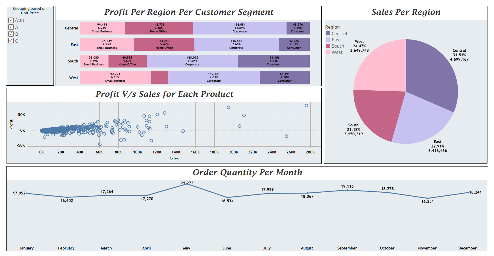

# Business Health Monitor (Tableau)

## 📊 Project Overview
This project explores sales and profit data from a fictional shopping website. Using Tableau, I designed a compact business health dashboard to monitor sales, profits, order quantity, and customer segment distribution across regions and products.

---

## 🧾 Dataset Summary

- **Rows**: 8,399
- **Fields Include**:
  - Order Info: `Order ID`, `Order Date`, `Order Quantity`, `Order Priority`
  - Financials: `Sales`, `Profit`, `Unit Price`, `Discount`, `Shipping Cost`
  - Customer Details: `Customer Name`, `City`, `State`, `Region`, `Segment`
  - Product Info: `Product Name`, `Category`, `Sub-Category`, `Container`
  - Dates: `Order Date`, `Ship Date`

---

## 📈 Visualizations

- **Line Chart**: Monthly Order Quantity trend
- **Pie Chart**: Sales by Region
- **100% Stacked Bar Chart**: Profit by Region segmented by Customer Segment
- **Scatter Plot**: Profit vs Sales per Region
- **Calculated Field Grouping**: Categorized products into three groups based on Unit Price using an IF-ELSE calculated field:
    - A: Unit Price ≤ 2500
    - B: Unit Price > 2500 and ≤ 5000
    - C: Unit Price > 5000

---

## 🔍 Key Insights

- 🧾 The **Corporate Customer Segment** generates the highest profits in every region.
- 📦 **May** has the highest order quantity.
- 🏙️ **Central Region** accounts for the largest sales share (31.5%).
- ❗ The product "**Okidata Pacemaker 4410N wide format dot matrix printer**" incurs a significant loss of ₹43,949.

---

## 🧠 Additional Features

- Data categorization using a **calculated field** (grouped by `Unit Price`)
- Dashboard includes filters and groupings for interactive analysis

---

## 📤 Tableau Public Link

[🔗 View the Dashboard on Tableau Public](https://public.tableau.com/app/profile/piyush.jha1660/viz/BusinessHealthMonitor/Business-Health-Monitor-Dashboard?publish=yes)

---

## 🖼️ Dashboard Preview

---

## ⚙️ Tools Used

- Tableau Desktop
- Tableau Public
- Data wrangling and visualization in Tableau (Calculated Fields, Filters, Custom Grouping)

---

## 🚧 Status
✅ Completed  
📌 Simple project — intended to showcase beginner-level Tableau skills with core business KPIs.
